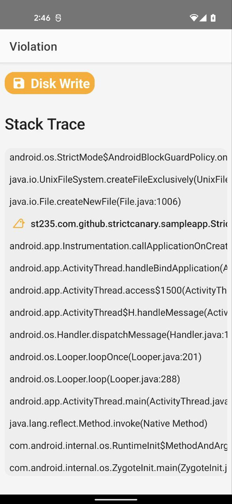
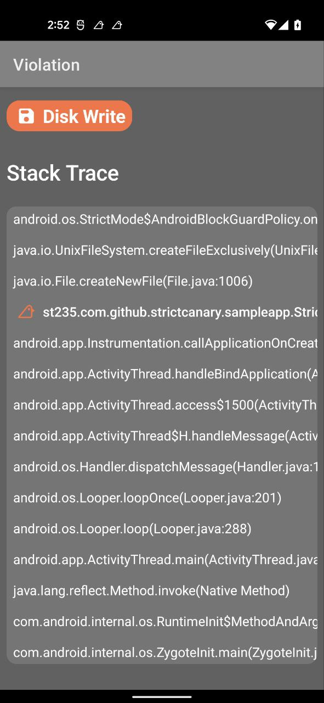

# Strict Canary

Strict Canary is a small tool to support soft "strict mode" enforcing. For more information see
[Android Strict Mode](https://developer.android.com/reference/android/os/StrictMode).

## Description

Strict Canary shows a small notification when detects strict policies violation. See example below:

| Collapsed  | Expanded |
| ------------- | ------------- |
|  |  |

By clicking notification strict canary activity opens allowing you to see detailed stack trace and
manage the violation.

| Light  | Dark |
| ------------- | ------------- |
|  |  |

## Download

On a side note: the library is published to __mavenCentral__ so it may be necessary to add __mavenCentral__ to
your repositories list in the root gradle file.

```groovy
allprojects {
    repositories {
        // your repositories

        mavenCentral()
    }
}
```

### Maven

```groovy
TBC
```

### Gradle

```groovy
TBC 
```

### Ivy

```groovy
TBC
```

P.S.: you can use the script below or the badge above to retrive the latest version

```bash
curl -s http://search.maven.org/solrsearch/select?q=g:"org.apache.maven.plugins"+AND+a:"maven-compiler-plugin" |grep -Po 'latestVersion.:.\K[^"]*'
```

## Usage

### Module

Let's begin from your module configuration. As Strict Canary sends notification we don't wanna let
our users to see them. Therefore the library provides no-op implementation to substitute Strict Canary
in release builds.

```groovy
    debugImplementation "st235.com.github.strictcanary:strictcanary:1.0.0"
    releaseImplementation "st235.com.github.strictcanary:strictcanary-noop:1.0.0"
```

### Configuration

To enable Strict Canary you need to put this code to your [Application#onCreate](https://developer.android.com/reference/android/app/Application#onCreate()) method.

```kotlin
    override fun onCreate() {
        super.onCreate()

        StrictCanary.setDetectionPolicy(
            StrictCanaryDetectionPolicy.Builder(this)
                .detect(StrictCanaryViolation.Type.DISK_READ)
                .detect(StrictCanaryViolation.Type.DISK_WRITE)
                .build()
        )
    }
```

Basic configuration seems pretty straightforward. However, StrictCanary.Builder supports additional
feature, like, base line file and 3rd party errors detection switcher.

### Baseline

Baseline helps you to ignore some of your strict mode violations. To define a baseline file you need
to define the issues list with their ids. You can ignore issue by file either by code line.

```xml
<?xml version="1.0" encoding="UTF-8" ?>
<strict-canary>
    
    <issue id="DiskRead">
        <ignore>StrictCanaryApplication.onCreate</ignore>
    </issue>
    
</strict-canary>
```

### License

```text
MIT License

Copyright (c) 2022 Alexander Dadukin

Permission is hereby granted, free of charge, to any person obtaining a copy
of this software and associated documentation files (the "Software"), to deal
in the Software without restriction, including without limitation the rights
to use, copy, modify, merge, publish, distribute, sublicense, and/or sell
copies of the Software, and to permit persons to whom the Software is
furnished to do so, subject to the following conditions:

The above copyright notice and this permission notice shall be included in all
copies or substantial portions of the Software.

THE SOFTWARE IS PROVIDED "AS IS", WITHOUT WARRANTY OF ANY KIND, EXPRESS OR
IMPLIED, INCLUDING BUT NOT LIMITED TO THE WARRANTIES OF MERCHANTABILITY,
FITNESS FOR A PARTICULAR PURPOSE AND NONINFRINGEMENT. IN NO EVENT SHALL THE
AUTHORS OR COPYRIGHT HOLDERS BE LIABLE FOR ANY CLAIM, DAMAGES OR OTHER
LIABILITY, WHETHER IN AN ACTION OF CONTRACT, TORT OR OTHERWISE, ARISING FROM,
OUT OF OR IN CONNECTION WITH THE SOFTWARE OR THE USE OR OTHER DEALINGS IN THE
SOFTWARE.
```
