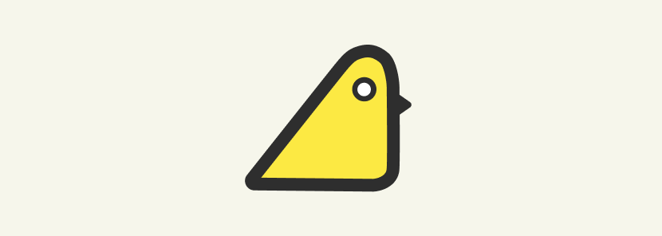

# Strict Canary

[](https://www.buymeacoffee.com/algoclub)


[](https://search.maven.org/search?q=g:%22com.github.st235%22%20AND%20a:%strict-canary%22)

Strict Canary is a small tool to support soft "strict mode" enforcing. For more information see
[Android Strict Mode](https://developer.android.com/reference/android/os/StrictMode).

## Description

We think that crashes or strict mode dialog windows can be really annoying, especially, in a large
project, therefore, Strict Canary offers "soft" implementation of the strict mode. When a violation
is detected Strict Canary will show a small and friendly notification, like, the notification below:

| Group notification |
| ------------- |
| 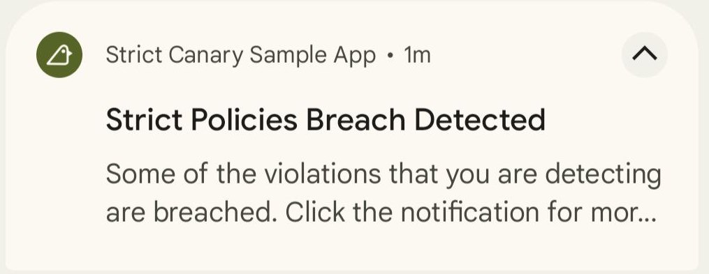 |

Moreover, this notification is clickable. By clicking it will see the list of most recent 150 violations that
have happened since the application was started.

However, if you wanna have more control over violations you can split this group notification into
a smaller notifications for every violation. You can see the an example of standalone notifications below:

| Collapsed  | Expanded |
| ------------- | ------------- |
| 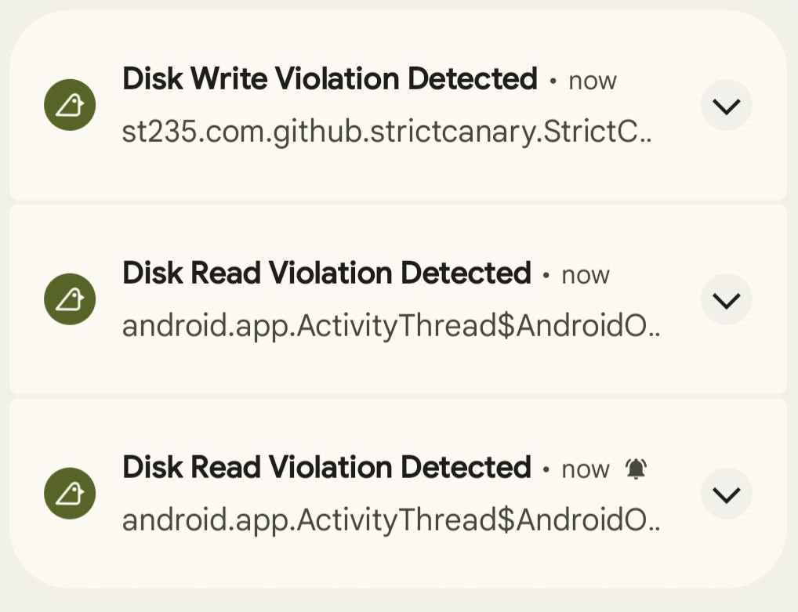 | 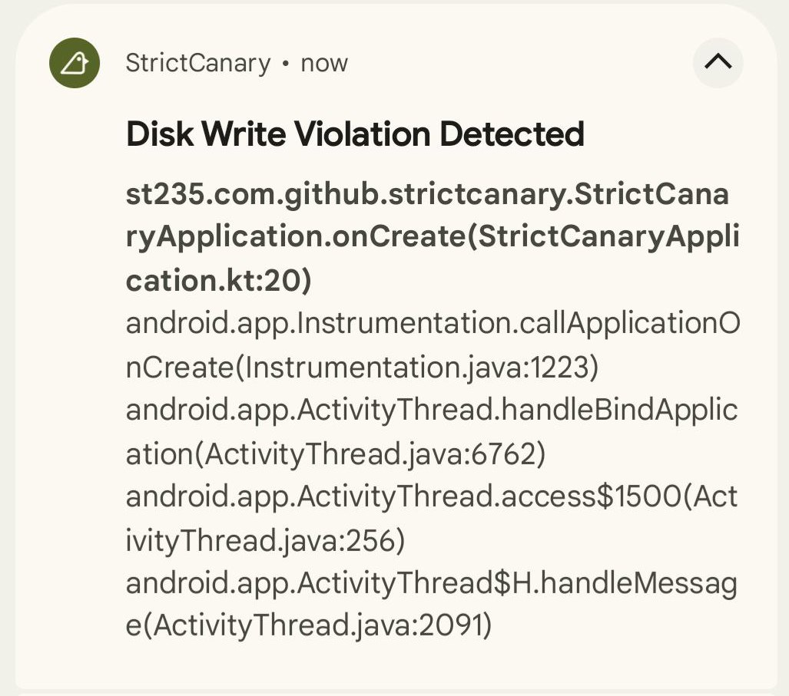 |

And what do you think - they are also clickable! Click it to see the detailed information.
See the examples of notifications contents below: 

| The most recent violations | Detailed violation screen |
| ------------- | ------------- |
| 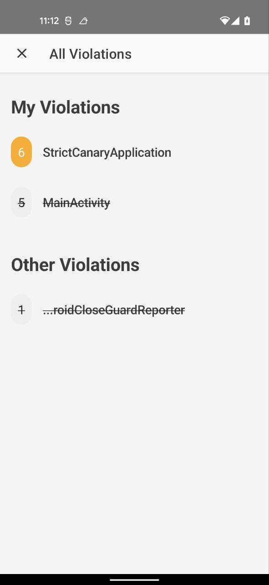 | 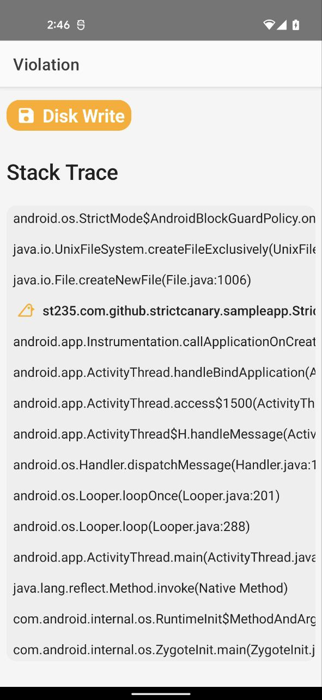 |

## Download

On a side note: the library is published to __mavenCentral__ so it may be necessary to add __mavenCentral__ to
your repositories list in the root gradle file.

```groovy
allprojects {
    repositories {
        // your repositories

        mavenCentral()
    }
}
```

### Maven

```xml
<dependency>
        <groupId>com.github.st235</groupId>
        <artifactId>strict-canary</artifactId>
        <version>x.x.x</version>
  <type>pom</type>
</dependency>
```

### Gradle

```groovy
implementation 'com.github.st235:strict-canary:x.x.x' 
```

### Ivy

```xml
<dependency org='com.github.st235' name='strict-canary' rev='x.x.x'>
  <artifact name='strict-canary' ext='pom' ></artifact>
</dependency>
```

P.S.: you can use the script below or the badge above to retrieve the latest version

```bash
curl -s "https://search.maven.org/solrsearch/select?q=g:com.github.st235+AND+a:strictcanary" | grep -oh '.latestVersion.:.[^"]*' | grep -oh '[0-9|.]*[0-9]$'
```

## Usage

### Module

Let's begin from your module configuration. As Strict Canary sends notifications we don't wanna let
your users to see them and spoil their experience. In light of this prerequisite,
the library provides __no-op implementation__ to substitute Strict Canary with a stub in release builds.
You can use the snipped below to separate debug and release logic.

```groovy
    debugImplementation "st235.com.github:strict-canary:x.x.x"
    releaseImplementation "st235.com.github:strict-canary-noop:x.x.x"
```

### Configuration

To let the magic 🪄 happens you need to write a little code. I promise this will be only a few changes.
You need to modify your [Application#onCreate](https://developer.android.com/reference/android/app/Application#onCreate()) method
and provide `StrictCanaryDetectionPolicy` to `StrictCanary` global instance.

```kotlin
    override fun onCreate() {
        super.onCreate()

        StrictCanary.setDetectionPolicy(
            StrictCanaryDetectionPolicy.Builder(this)
                .detect(StrictCanaryViolation.Type.DISK_READ)
                .detect(StrictCanaryViolation.Type.DISK_WRITE)
                .rawBaseline(R.raw.strictcanary_baseline)
                .showAllViolationsAtOnce()
                // or .showEveryViolationAsSeparateNotification()
                .build()
        )
    }
```

Basic configuration seems pretty straightforward. However, `StrictCanaryDetectionPolicy.Builder` supports additional
features, like, base line file or 3rd party errors detection switcher.

### Baseline

You may wonder, "What should I do if there are some violations that I cannot fix right now"? 
I have an answer for you: you need to use a baseline file.

__Baseline__ is a special document that helps you to ignore some of your strict mode violations. 
To define and use the file successfully you need to follow a few simple rules:

- Every issue should use `<ignore>` tag and use either a `path` attribute that ignores the whole
file either specify the code entry with the tag; 
- All issues should be grouped in a group that uses `<issue>` tag. However, it is not possible to 
define an empty group, you need to specify an `id` attribute;
- All groups should be inside of a parental tag `<strict-canary>`.

```xml
<?xml version="1.0" encoding="UTF-8" ?>
<strict-canary>
    
    <issue id="DiskRead">
        <ignore message="Let's better explain why we ignore issues">StrictCanaryApplication.onCreate</ignore>
    </issue>
    
</strict-canary>
```

P.S.: Now you're good to go. Let's do the main thread great again!

### Misc

| Title | Description | Screenshot |
| ------------- | ------------- | ------------- |
| Dark mode 🌗 | A wonderful dark theme will change with the system | 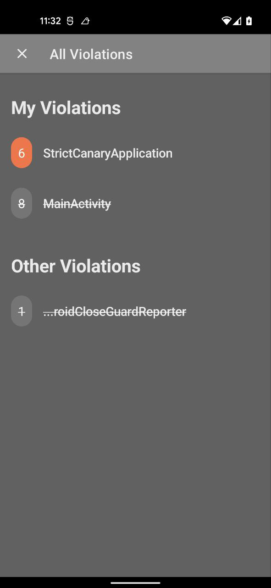 |
| | __Additional dark theme screenshots__ | 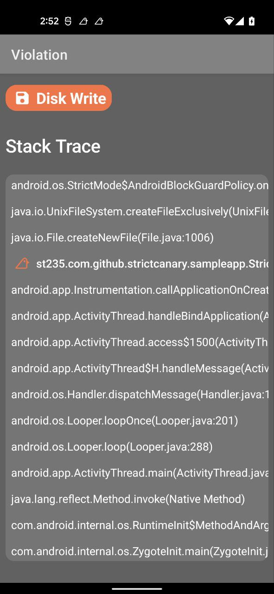 |
| Baseline Highlight | Violations that are ignored by baseline file are visually over crossed | 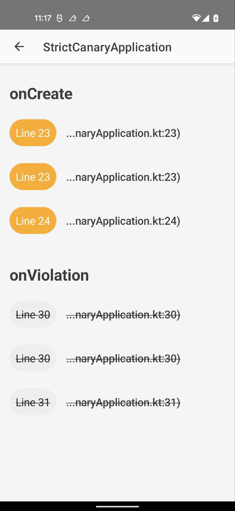 |
| Tags | More tags supported: __ignored by baseline__, __3rd party__, __source__ | 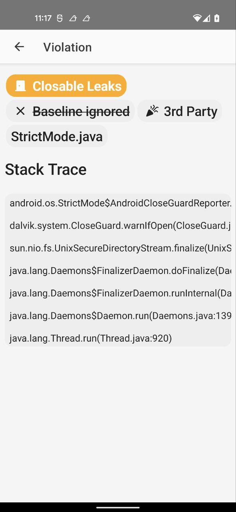 |
| No Violations | If no violations were found you will see our mascot bird 🐤 | 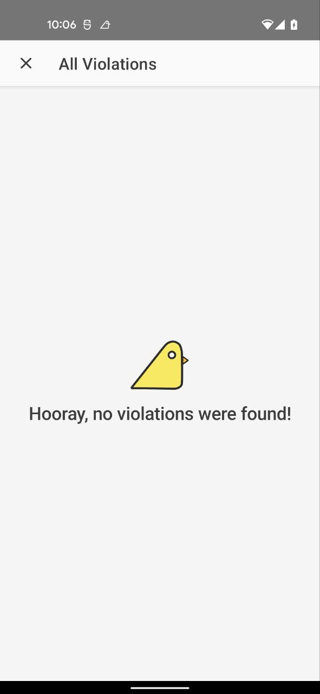 |

### License

```text
MIT License

Copyright (c) 2022 Alexander Dadukin

Permission is hereby granted, free of charge, to any person obtaining a copy
of this software and associated documentation files (the "Software"), to deal
in the Software without restriction, including without limitation the rights
to use, copy, modify, merge, publish, distribute, sublicense, and/or sell
copies of the Software, and to permit persons to whom the Software is
furnished to do so, subject to the following conditions:

The above copyright notice and this permission notice shall be included in all
copies or substantial portions of the Software.

THE SOFTWARE IS PROVIDED "AS IS", WITHOUT WARRANTY OF ANY KIND, EXPRESS OR
IMPLIED, INCLUDING BUT NOT LIMITED TO THE WARRANTIES OF MERCHANTABILITY,
FITNESS FOR A PARTICULAR PURPOSE AND NONINFRINGEMENT. IN NO EVENT SHALL THE
AUTHORS OR COPYRIGHT HOLDERS BE LIABLE FOR ANY CLAIM, DAMAGES OR OTHER
LIABILITY, WHETHER IN AN ACTION OF CONTRACT, TORT OR OTHERWISE, ARISING FROM,
OUT OF OR IN CONNECTION WITH THE SOFTWARE OR THE USE OR OTHER DEALINGS IN THE
SOFTWARE.
```
